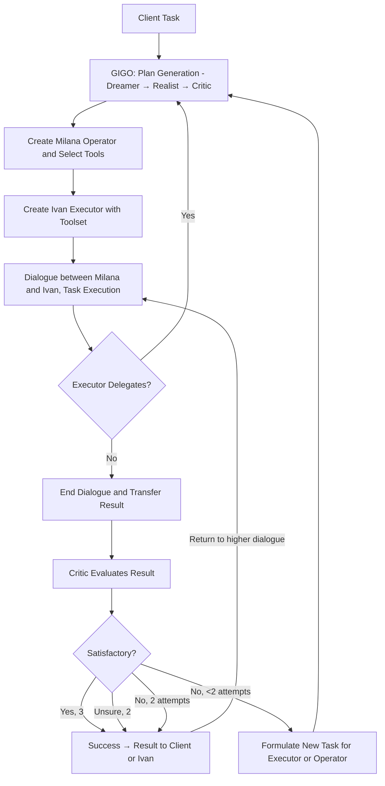

<p align="center"></p>
<h1 align="center"><span style="color: #5200ff;">Milana</span></h1>
<p align="center"><strong>Autonomous · Independent · Free · For Mere Mortals</strong></p>
<p align="center">Discord: iishnitsa_milana</p>
<p align="center">License: <a href="LICENSE">MIT</a> (code) · bundled OCR weights under their own licenses (see LICENSE)</p>

[Features (+video demo)](#features-and-use-cases) | [How It Works](#how-it-works) | [History](#history-and-project-details) | [Installation](#installation-and-getting-started-for-users-or-developers-in-venv-for-windowsmacoslinux-or-exe-build) | [How to Use](#how-to-use) | [Module Development](#how-to-develop-modules) | [Provider Development](#how-to-develop-model-providers) | [Third-Party Modules and Providers](#third-party-modules)

Here is what I am **trying** to achieve.

## Autonomous
It develops an execution plan, delegates complex tasks, and verifies itself without human intervention. Hierarchical delegation allows returning fully developed results instead of abstract answers for complex tasks. Using deep research? A single request of yours will trigger a chain of deep research and reasoning.

## Independent
Requires only a connection to a model, which can also run locally. Agent memory is stored locally. Computations happen locally.

## Free
No request limits, file upload limits, paid subscription tiers, or regional restrictions.

## For Mere Mortals
Just run the Windows installer or the Linux `.run` installer; no console required.

## Optimized for Weak Models
Initially I was limited by an old laptop, and then it became a principle. I write detailed prompts, add hints when the model breaks the command protocol, and give weak models some leeway (typos in commands, softer rules). Further ideas that already help:

- Splitting into **two agents** so context is not clogged: the executor is recreated after a subtask, while the operator’s context is not fully filled with that subtask.
- Generating a **work plan** so the agent knows what to do from the start.
- **Result evaluation** (critic).
- An automatic **Git-based filesystem** layer to protect files from agent mistakes.
- Optionally using an even **weaker model** for simpler jobs (e.g. summarization) to save cost.

More optimizations will come.

## Universal
Supports any sufficiently smart instruct model. The model doesn't necessarily need agentic or tool-calling capabilities, nor does it need to strictly follow specific standards.

## The Best — for me
The prototype is still far from a polished state, but I will keep improving it, putting my soul and vision into it.

## Features and Use Cases
Module support lets the system do almost anything — even turn on a kettle. Useful built-ins: web search (multi-line queries), deep research, reports, cross-platform `shell_cmd`, and file tools on the new `filesystem` API. An optional MCP URL loads remote tools. You can write your own module using the docs below.

The request I used to debug the system was about progress in Alzheimer’s treatment — an ambiguous topic that needs careful study. Literally:

**perform a meta-study on the entire study of alzheimer's and drugs for this disease, draw conclusions about what alzheimer's is according to the most likely theory (this can be found out by comparing many works), about scandals, about misconceptions, etc., in order to get the most reliable information about what alzheimer's is and how to treat it
periodically make reports on the information found and the conclusions drawn**

**Demo (08 2026):** recorded on Ollama `gemma3:4b`. It did not work on the first try and is not great — but the previous release would not have allowed this demo at all. For this workload the model is **not very stable**; for real use I still recommend **`gemma4:e4b`** or **`qwen3.5:9b`**. [YouTube](https://youtu.be/kXu3Uc1MgS8). The older demo showed high stability on Qwen3.5 (04 2026 release, cloud Qwen3.5 9b): [YouTube](https://www.youtube.com/watch?v=USj5WB6UfME).

## How It Works

The system receives the client task → the GIGO block (Dreamer → Realist → Critic) builds a plan → operator Milana is created with a toolset → executor Ivan is created with his toolset → dialogue starts. If the executor cannot handle the task, it may delegate to a new level (again via GIGO). When finished, Critic evaluates the result (up to two attempts by default): success → client / level above; unsure → human check; bad but attempts left → refined task and recreate; both attempts exhausted → critic comments go one level up.

File tools go through the local `filesystem` API (per-dialog session, optional git/worlds, import-on-read) so agents can touch the project safely — details in the filesystem spoiler under History.

<details>
<summary>History and Project Details</summary>
One day I asked ChatGPT for help with a project and got a plan. At first I fed tasks one by one; then I had the idea to make the model talk to itself.

Later I realized the tasks were too hard — they needed plans too. The idea grew into a hierarchy that grows by one level on the AI’s command.

I started with LangChain — seemed good for an agent that creates hierarchy levels. Problems:
1. LangChain changes constantly and heavily.
2. It targets strong models; weak ones easily break commands.
3. Poor fit into custom code.

So I wrote my own mechanism.

Not everyone has strong AI, a fast PC, or a power plant for servers. Weak models can still help if you approach them right: I allowed typos in commands and simplified prompts.

**upd1**
While preparing the December 2025 release I realized hierarchy fits programming poorly (see AlphaEvolve / related work). A big issue is data exchange across levels and dialogues; I tried saving dialogues into embeddings for the librarian. Safe file handling was still needed — experimenting with structures.

**upd2 05 2026**
Mostly bugfixes, small polish, and a redesign. Fixed data exchange: agents can see info about other dialogues, including deleted ones.

I removed “10,000 monkeys” and best-solution selection — raw, expensive, and slow; not in the spirit of a cheap system on fast small models.

My own command protocol turned out more convenient than standards: not tied to native function calling or a specific calling convention. Native call remains but is not deeply tested — better leave it off for now.

**upd3 08 2026**

- Prompt polish
- New `filesystem/` API for tools (worlds / dual-write / optional git); see spoiler below
- Optional small/large model pairing
- Agent personalities
- Translation (some small models work better in their native language)
- MCP URL for remote tools
- Soft hints / leeway when weak models break protocol; hierarchy limit (0 = unlimited)
- Some UI speedups, light theme, scaling
- Ollama demo default: `gemma3:4b`; for stability prefer `gemma4:e2b` / `gemma4:e4b`
- Many bugfixes — e.g. a previous-release bug that truncated context with local Ollama
- Many features made optional; different tiny models need different settings
- Lots of small improvements

There will be a large refactor. Plans: an upper agent somewhat like OpenClaw, better coding help for agents, extreme context compression, improving RAG / Critic / GIGO / filesystem, maybe splitting into parts for systems more complex than a 2-agent dialogue hierarchy — and keep adapting to weak models.

Most importantly, I understood the main weakness of small models. Agent-oriented models are trained for long work with large context and staying on topic without drift. Closest are reasoning models — in a sense agent models descend from them. The smaller the model (even reasoning, and especially non-reasoning), the worse it is at long sessions. Even with native tool calling, training is often on short Q&A dialogues — fine for a support chatbot (query → tool → answer), but quality drops message by message. A live user also keeps the topic from drifting. Splitting operator/executor helped a bit when the operator had few messages and kept a busy executor on track. Generating complementary personalities is another attempt. Better RAG may help further; I want a more radical fix, though I don’t fully know the shape yet.

The project is still raw. Ideas, bug reports, and suggestions are welcome. Versions are tagged by publication date.
</details>

<details>
<summary>filesystem/ (product modules)</summary>

Editable after freeze (loaded from `base_dir` like `default_tools`). Namespace package: import **submodules**, not the package root. No `__init__.py`.

| Module | Role |
|--------|------|
| `core.py` | worlds, dual-write, import-on-read, last_seen |
| `api.py` | `pipeline`, navigator helpers, lazy init, optional `@cacher` |
| `tool_arg.py` | `one_line_arg` / `clean_tool_arg` |

```python
from filesystem.api import pipeline, change_dir, …
from filesystem.tool_arg import one_line_arg
```

`cross_gpt.initialize_work` puts `base_dir` on `sys.path`. **Do not** add `--hidden-import filesystem*` to the freeze: only `launcher.py` is in the exe; `filesystem/` stays editable next to the binary.

Behaviour:
- **Main-first** — no auto fork on hierarchy
- **Import-on-read** — pull missing path from other world / disk
- **No auto-merge** on end_dialog
- **Session default** — when tools omit `session_id`, pipeline uses `global_state.now_try`
- **Optional** `fs_copy_touched_on_end` → `chat/dialog_artifacts/…` (default off)
- **Optional** `fs_use_git` (default on). Off → plain disk CRUD without git/worlds
- **Lazy init** on first API call
- **create_report** does not use this package
</details>

<details>
<summary>Installation and Getting Started for Users or Developers in Venv for Windows/macOS/Linux or .exe Build</summary>
**For users**

- **Windows:** `MilanaSetup.exe` (optional task: image recognition models ~1 GB) or the smaller `MilanaSetup-nomodels.exe` (no weights inside, no prompt; OCR stays off).
- **Linux:** `MilanaSetup.run` (question about models) or `MilanaSetup-nomodels.run` (no weights inside, no prompt). Menu/desktop shortcuts are offered. **OCR on Linux needs AVX2**; without AVX2 the “recognize images” switch stays off even if models are installed.
  - After install you typically get a `milana` launcher (e.g. under `~/.local/bin`) and/or a desktop/menu entry pointing at the install directory. You can also run `./Milana` from the install folder.

<details>
<summary>Installation Windows/macOS/Linux Venv, `.exe` or `ELF` Build</summary>
<details>
<summary>**Windows**</summary>
You need:
- `Git`
- `MSVC Build Tools`
- `Python 3.13.7` (not `3.14`; some libraries are not ready yet) with `Tk`

Run `windows.bat` in `install` → `start_milana.bat`.
Or `buildexe.bat` → `Milana.exe`.
Installer: Inno Setup + `InnoSetupInstallerBuild.iss` in `install` (`compile_innosetup.bat` builds both). `iscc InnoSetupInstallerBuild.iss` → `MilanaSetup.exe`; `iscc /DNoModels InnoSetupInstallerBuild.iss` → `MilanaSetup-nomodels.exe`.
</details>
<details>
<summary>**Linux and macOS**</summary>
You need:
- pyenv
- Python tk packages, e.g. `sudo pacman -S tk` (if you forgot: `pyenv uninstall 3.13.7`, install tk, retry)

Run `linux_macos.sh` in `install`.
ELF: `buildlinux.sh`, then pack `.run` files with `make_linux_installer.sh` (default: both `MilanaSetup.run` and `MilanaSetup-nomodels.run`).
</details>
</details>

## Getting started
Open **chat settings** after creating a chat — defaults are set, but models often need tuning.

Pay attention to the **Small model** tab: you can enable a cheaper/weaker model for lighter jobs (summaries / cutter by default). Copy params from the large model (except `model=`), validate the small connection, and clamp token limits. Leave it off if you only want one model.
</details>

<details>
<summary>How to Use</summary>
1. Run Milana and configure the model. Prefer **`gemma4:e4b`** or **`qwen3.5:9b`** (Ollama). The default field may show `gemma3:4b` (quick try / demo, less stable).
2. Pick a provider (Ollama, llama.cpp, OpenAI-compatible, Grok/xAI, …). For Ollama also pull `all-minilm:latest` (embeddings). Click `Validate model` and save.
3. Optionally: **small model**, **agent personalities**, translation, **MCP URL**.
4. Enable the modules you need.
5. Create a chat, enter a task, send.

Chat settings (selection; defaults highlighted)
- **Use RAG** — on by default.
- **Task elaboration / classic GIGO** — on by default (`use_gigo` + classic/`use_old_gigo`).
- **Librarian in GIGO** — on by default.
- **Max critic reactions** — default **0** (critic reactions off unless you raise it).
- **Allow commands not at start** — on by default.
- **Copy user attachments** into the chat `files/` folder — on by default.
- **Mid-dialog** user message delivery (`deliver_user_messages`) — on by default.
- Hierarchy limit: 0 = unlimited; `1` = one root dialog without deeper delegation.
- OCR: needs bundled models; on Linux also **AVX2**.
- MCP URL: optional remote tools.

**Notes:**
- For stability use a stronger model than the one that failed you. Demo default `gemma3:4b` is weak.
- Best-tested path today: **Ollama** (also llama.cpp / scripted / cloud OpenAI-style).
- On errors, write to Discord **iishnitsa_milana**: screenshots/videos, `log.txt`, `cache.db`, `chatsettings.db`, and other files from the chat folder, plus a description.
</details>

<details>
<summary>How to Develop Modules</summary>
File tools should use the `filesystem` API (`filesystem.api.pipeline`, `filesystem.tool_arg`, …) instead of ad-hoc disk IO — see the filesystem spoiler above. Keep `filesystem/` editable next to the frozen binary.

A module consists of:
- A main file (e.g., `shell_cmd.py`).
- An optional localization file with the same name ending in `_lang` in the same folder (e.g., `shell_cmd_lang.py`).

**Module Structure:**
```python
'''
# Command for the model (e.g., execute_command)
# Brief description for the model
# Module name for the user
# Description for the user
'''

def main(text: str) -> str:
    if not hasattr(main, 'attr_names'):
        main.attr_names = (
            'output_text',
            'forbidden_text',
            'path_error_text',
            'timeout_text',
            'exception_text'
        )
        main.output_text = 'Output'
        main.forbidden_text = 'Forbidden command detected'
        main.path_error_text = 'Access to paths outside the workspace is forbidden'
        main.timeout_text = 'Command timed out'
        main.exception_text = 'Error:'
        return

    # Module logic
    return "Result"
```
Localization file (optional but recommended; you can also leave `main.` strings in the main file empty and move 'en' localization to the localization file):
```python
locales = {
    'ru': {
        'module_doc': [
            'command_for_model',
            'description_for_model',
            'name_for_user',
            'description_for_user'
        ],
        'main.output_text': 'Output',
        'main.forbidden_text': 'Forbidden command',
        # other strings
    }
}
```
Rules:
- The `main` function accepts and returns only text.
- Localization simplifies the work for both the model and the user.
- For text sent to the AI or user, use the `attr_names` structure; this is required for localization to work.
- The localization file must be in the same folder as the module.
- The `_lang` suffix for the localization file is mandatory.
- It is strongly recommended not to use third-party libraries or libraries not in `requirements.txt`. If necessary, ensure the module acts as a layer between your service (which will include third-party libraries) and Milana.
- You can use Milana's system functions, such as querying the LLM, with some caution.
- Consider the specifics of the cache system.

<details>
<summary>How to correctly use system functions **and work with system state saves for recovery after restart!**</summary>
Progress saving is done through caching:
- Critically important operations (changes in SQLite and ChromaDB databases, to avoid repeated modification or access to already modified or deleted data).
- Expensive and time-consuming operations (generation, web search, computations).
- Inside operations that change the system state, if they don't directly relate to changing the system state (e.g., `ask_model` inside `start_dialog`).

Caching is forbidden for operations:
- Changing the system state (e.g. outer `@cacher` on `start_dialog` / `end_dialog` / hierarchy helpers) — those must re-run so RAM/DB reach the pre-crash state. Mark such helpers with `@no_cache` if needed.
- Anything that would change the **number** of cached slots between the original run and resume (unstable branching).

**Nesting is supported:** outer `@cacher` may call inner `@cacher` (marker stack / `\x02` descent). Do **not** call `@no_cache` functions from inside an active `@cacher` body.

The system caches many types of data (not classes/functions). Exceptions are stored and re-thrown on replay. Serialization uses `pickle`.

The caching system consists of:
- `read_cache` / `write_cache` — sequential slots in `cache.db` (`cache_counter`).
- `cacher` — `@cacher` decorator around those.
- On resume, `left_cache_counter` is set from `COUNT(*)` so the worker replays until the miss point.

In most cases you only need `@cacher`. Manual `read_cache`/`write_cache` only when necessary (e.g. `tools_selector`); any sequence break breaks resume.

If your tool does **not** import “important” APIs from `cross_gpt` (`ask_model`, `sql_exec`, …), `tools_selector` caches the whole `main()` result automatically.

If you **do** import those APIs, the tool is treated as “system”: `main()` re-runs on resume; put `@cacher` on expensive / non-idempotent pieces inside (LLM, HTTP, shell execute, file write).

```python
from cross_gpt import cacher, ask_model

@cacher
def get_weather():
    return ask_model('…')  # OK: nested slots; keep a stable call count
```

List of common decorated helpers:
- `ask_model`, `get_embs`, `text_cutter`, `sql_exec`, `coll_exec`
- `get_input_message`, `send_output_message` (UI chat queue; cached)
- `let_log` / `send_log_to_ui` — **not** `@cacher` (debug only; `send_ui_no_cache` for errors that must always show)

Everything else is at your own risk.
</details>
<details>
<summary>How to use some useful system functions</summary>
When writing your own modules, you can use built-in core functions. **All of them already have built-in caching**—you don't need to manually write `read_cache` / `write_cache` logic.

#### 1. `ask_model`
`ask_model(prompt_text, ...)`—the main function for generating responses with automatic fallback via `text_cutter` on context overflow.

**Basic Parameters**
* `prompt_text` (str, required): Request text.
* `system_prompt` (str, optional): System instruction.
* `all_user` (bool): If `True`, forces passing the entire context as the user (ignoring roles).
* `temperature` (float): Default 0.6.
* `limit` (int): Token limit (if supported).

**Dialogue Formation**
Pass a string assembled with markers to `prompt_text`. There should be an odd number of messages, not counting the system prompt. At the end, add a model marker (needed by the parser to determine roles); this marker should not be the same as the marker marking the first non-system message. The markers themselves are removed by the parser. Maintain message alternation.
Three system marker variables are defined in the core for this:
* `system_role_text`: system prompt marker (optional).
* `operator_role_text`: interlocutor 1 marker (e.g., user).
* `worker_role_text`: interlocutor 2 marker (e.g., model).

#### 2. Vector Memory (ChromaDB)
`get_embs(text)` returns a vector (list of floats) for the passed text. Returns [] on error. Text is automatically truncated on context overflow.

`coll_exec(action, coll_name, ...)` is a universal cached wrapper for any operations with vector collections.

Actions: add, update, delete, query, get, count, modify, delete_collection.
Collections (`coll_name`):
- `user_collection`: user files.
- `milana_collection`: system memory (dialogues, work results, web search results).
- `rag_collection`: stores message vectors for composing dialogues.

Filtering (`filters` parameter): Supports comparison operators and logical links. Used in `query` and `get`.
Operators:
- `$eq`, `$ne`: equal, not equal.
- `$gt`, `$gte`, `$lt`, `$lte`: comparison of numbers/strings.
- `$in`, `$nin`: inclusion in list / non-inclusion.
- `$and`, `$or`: logical groupings.

**Examples of Queries with Filters**

Search only among successful dialogues:
```python
result = coll_exec(
    action="query",
    coll_name="milana_collection",
    query_embeddings=[get_embs("alzheimer's treatment")],
    filters={"result": True},   # $eq by default
)
```
Exclude web sources:
```python
result = coll_exec(
    action="query",
    coll_name="user_collection",
    query_embeddings=[get_embs("latest news")],
    filters={"source": {"$ne": "web"}},
    n_results=5
)
```
Complex filter with `$and`:
```python
result = coll_exec(
    action="get",
    coll_name="milana_collection",
    filters={
        "$and": [
            {"done": "correct"},
            {"hierarchy": {"$contains": "/2:"}}   # example with partial string match
        ]
    },
    fetch="documents")
```
Filter by a list of values `$in`:
```python
result = coll_exec(
    action="query",
    coll_name="user_collection",
    query_embeddings=[get_embs("reports")],
    filters={"source": {"$in": ["file", "web"]}},
    n_results=8)
```
Important: When using `$in` or `$nin` for the `vector_id` field (i.e., filtering by document identifiers), `coll_exec` automatically switches to an efficient collection traversal algorithm. In other cases, filters work normally.

Example search with multiple conditions and metadata retrieval:
```python
result = coll_exec(
    action="query",
    coll_name="milana_collection",
    query_embeddings=[get_embs("plan criticism")],
    filters={"done": "incorrect", "dialog_type": "executor"},
    fetch=["documents", "metadatas", "distances"],
    n_results=3)
```
`result` will be a dictionary with keys 'documents', 'metadatas', 'distances'.

#### 3. Built-in Search Modules
The `librarian` and `simple_web_search` modules use cached core functions internally. Prefer not wrapping whole system-tool `main` bodies in another outer `@cacher`; nest `@cacher` only around stable expensive helpers.

* `librarian`
    Intelligent database search. Searches first in system memory (`milana_collection`), then in user data (`user_collection`). If the internet is enabled and nothing is found, it automatically triggers a web search if available (if you've connected `simple_web_search.py` or another module ending in `_web_search.py`). Returns formatted snippets with sources.
    *Important rule for prompts:* When forming requests to the librarian, **be sure to put a question mark at the end of lines with questions**, as the module relies on them when parsing multi-line requests; a separate search is performed for each multi-line request, so requests must be self-contained.
    ```python
    from cross_gpt import librarian
    result = librarian("What are the latest studies on RAG architecture?\nWho is their author?\nHow to correctly apply RAG?")
    ```

* `simple_web_search`
    Direct search via DuckDuckGo. Accepts 1 query, collects raw website texts, compresses them, and returns a summary with links. Works only if web search is allowed in settings.
    ```python
    from cross_gpt import web_search
    result = web_search("python 3.12 release notes")
    ```
    You can write your own search module ending in `_web_search.py`, and `librarian` will use it.

#### 4. Auxiliary Utilities

* **`text_cutter(text, cut_message=False)`**: iterative compression of long reads via LLM.
    * `False`: brief summary (summarization).
    * `True`: detailed paraphrasing (without losing minor facts from the user's message).
* **`let_log(text)`**: output debugging information to the console and record it in `log.txt`.
* **`send_output_message(text=None, attachments=None)`**: send a message to the user interface.
* **`get_input_message()`**: wait for a message from the user sent after executing this command.
* **`send_log_to_ui(message)`**: send service text to the UI log window.
</details>
</details>

<details>
<summary>How to Develop Model Providers</summary>

Providers are scripts that teach Milana to communicate with different APIs (Ollama, OpenAI, Anthropic, etc.).
The system (`ui.py` and `cross_gpt.py`) reads the provider code directly (parses the file's AST tree), so the provider structure is strictly regulated. If the rules are violated, the provider won't even appear in the interface settings.

### 1. File and Import Rules
* **File Name:** Must be in the `model_providers` folder and end in `_provider.py` (e.g., `gemini_provider.py`). Must not start with an underscore `_`.
* **Dependencies:** Only built-in Python libraries (e.g., `json`, `re`, `time`) and the `requests` library are allowed. **Forbidden** to use third-party SDKs (like official `openai` or `anthropic` libraries), as users of compiled `.exe` versions won't be able to install them. All requests are made via raw `requests`.
* **Logging:** To output logs to the interface, import the system function: `from cross_gpt import let_log`.

### 2. Mandatory Global Variables
The system reads these variables directly from the module's namespace. They must be declared at the file level:

```python
# Default context limits
token_limit = 4095
emb_token_limit = 4095

# API capability flags
do_chat_construct = True  # Whether to use the Chat API (user/assistant roles). Almost always True.
native_func_call = False  # Whether the API supports native function calling (Tool calling). Usually False.

# Mandatory tags dictionary. If the API doesn't use explicit tags, leave them empty.
tags = {
    "bos": "", "eos": "",
    "sys_start": "", "sys_end": "",
    "user_start": "", "user_end": "",
    "assist_start": "", "assist_end": "",
    "tool_def_start": "", "tool_def_end": "",
    "tool_call_start": "", "tool_call_end": "",
    "tool_result_start": "", "tool_result_end": "",
}
```
### 3. Mandatory `connect` Function (The most important part!)
The application interface scans this function to dynamically build the settings menu. A `params` dictionary must be declared inside the function. The keys of this dictionary will become input fields in the UI.

If a key name contains the word `file`, `path`, or `dir`, the UI will automatically create a file selection button for it.
```python
def connect(connection_string, timeout=30, _decrypted_token=None):
    global token_limit, emb_token_limit, do_chat_construct, native_func_call, tags
    
    # ATTENTION: The params dictionary MUST be declared exactly like this.
    # ui.py parses this section of code to create fields in the settings!
    params = {
        "url": "http://api.example.com",
        "model": "example-model",
        "emb_model": "example-embed",
        "token": "", # UI will hide input with asterisks if the key contains token or password
    }

    # Parsing connection_string, which the UI will send after clicking "Save"
    for part in connection_string.split(";"):
        part = part.strip()
        if not part or "=" not in part: continue
        key, value = part.split("=", 1)
        key = key.strip().lower()
        if key in params:
            params[key] = value.strip()

    # The token may come encrypted from the UI (if a password is set),
    # then it is unpacked into _decrypted_token
    api_key = _decrypted_token if _decrypted_token else params["token"]

    try:
        # Here you initialize the requests session and check API availability
        # session = requests.Session() ...
        # response = session.get(...)
        
        # If successful, MUST return a list of 3 elements:
        # [Status (bool), Chat model token limit (int), Tags (dict)]
        return [True, token_limit, tags]
        
    except Exception as e:
        # If error, return 4 elements:
        # [Status (False), 0, Tags, "Error text"]
        return [False, 0, tags, f"Connection error: {e}"]
```
### 4. Mandatory Generation Functions
The system expects three functions for working with models. In them, it is necessary to correctly handle context overflow: if there are too many tokens, you must raise an exception with the string 'ContextOverflowError' in the text.
```python
def disconnect():
    """Closes the requests session and clears data."""
    # global session; if session: session.close(); session = None
    return True

def ask_model(generation_params):
    """
    Old completions method.
    Accepts a dictionary (contains the 'prompt' key).
    MUST return a string (str).
    """
    prompt = generation_params.get("prompt", "")
    # Make request to API...
    # Return text
    return "Generated text"

def ask_model_chat(generation_params):
    """
    Chat completions method.
    Accepts a dictionary (contains the 'messages' key).
    MUST return the FULL response dictionary from the API (dict).
    Parsing (searching for 'choices' or 'message') will be done by the system itself in cross_gpt.py.
    """
    messages = generation_params.get("messages", [])
    # Make request to API...
    # ...
    # If context is overflowed:
    # raise RuntimeError("ContextOverflowError")
    
    # Return raw JSON response from requests
    return {"choices": [{"message": {"content": "Model response"}}]}

def create_embeddings(text):
    """
    Embeddings generation method.
    MUST return a list of floating-point numbers (List[float]).
    """
    text = text.strip()
    # Make request to API...
    # ...
    # If context is overflowed:
    # raise RuntimeError("ContextOverflowError")
    return [0.01, -0.02, 0.05, ...]
```
### 5. Error Handling (Retry Logic)
Since you are using raw `requests`, you must independently implement retry logic (Exponential Backoff) for 429 (Rate Limit), 500+ (Server Errors), and network timeouts. Study the `_request_with_backoff` function in `ollama_provider.py` as a reference example.

Important exceptions expected by the engine:
- When API balance is exhausted: `raise RuntimeError("balance end")`
- On context overflow: `raise RuntimeError("ContextOverflowError")`
</details>

<details>
<summary>Third-Party Modules</summary>
Links to modules developed by the community will appear here.
</details>

<details>
<summary>Third-Party Providers</summary>
Links to providers developed by the community will appear here.
</details>