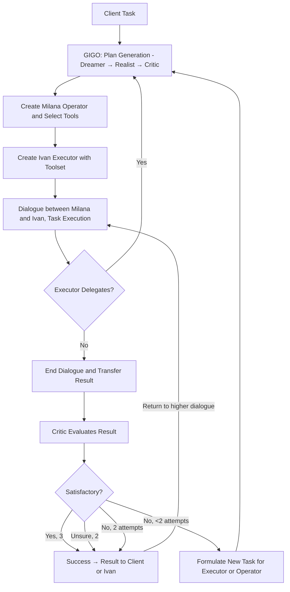

<p align="center"></p>
<h1 align="center"><span style="color: #5200ff;">Milana</span></h1>
<p align="center"><strong>Autonomous · Independent · Free · For Mere Mortals</strong></p>
<p align="center">Discord: iishnitsa_milana</p>

[Features (+video demo)](#features-and-use-cases) | [How It Works](#how-it-works) | [History](#history-and-project-details) | [Installation](#installation-for-users-or-in-venv-for-windowsmacoslinux-or-exe-build) | [How to Use](#how-to-use) | [Module Development](#how-to-develop-modules) | [Provider Development](#how-to-develop-model-providers) | [Third-Party Modules and Providers](#third-party-modules)

Here is what I am **trying** to achieve.

## Autonomous
It develops an execution plan, delegates complex tasks, and verifies itself without human intervention. Hierarchical delegation allows returning fully developed results instead of abstract answers for complex tasks. Using deep research? A single request of yours will trigger a chain of deep research and reasoning.

## Independent
Requires only a connection to a model, which can also run locally. Agent memory is stored locally. Computations happen locally.

## Free
No request limits, file upload limits, paid subscription tiers, or regional restrictions.

## For Mere Mortals
Just run the Windows installer or the Linux `.run` installer; no console required.

## Optimized for Weak Models
Initially, I was limited by an old laptop, and then I grew to like it. I write detailed prompts, add hints when the model makes protocol mistakes, and allow some leniency for weak models (typos in commands, softer recovery). It spends an incredibly small number of tokens on medium-complexity tasks. More to come.

## Universal
Supports any sufficiently smart instruct model. The model doesn't necessarily need agentic or tool-calling capabilities, nor does it need to strictly follow specific standards.

## The Best
The prototype is far from an attractive state, but I will constantly improve it, putting my soul and vision into it.

## Features and Use Cases
Module support allows the system to do anything, even turning on a kettle. Useful built-ins include web search (multi-line queries), deep research, report generation, cross-platform `shell_cmd`, and file tools on the new `filesystem` API. Optional MCP URL loads remote tools. You can write your own module using the documentation below.

The request I used to debug the system was related to progress in Alzheimer's treatment, as this ambiguous topic requires meticulous study. Literally, it was:

```
perform a meta-study on the entire study of alzheimer's and drugs for this disease, draw conclusions about what alzheimer's is according to the most likely theory (this can be found out by comparing many works), about scandals, about misconceptions, etc., in order to get the most reliable information about what alzheimer's is and how to treat it
periodically make reports on the information found and the conclusions drawn
```

**Demo (08 2026):** will be recorded on Ollama `gemma3:4b` (easy default). That model is **not very stable** for this workload — for real use we recommend **`gemma4:e2b`** or **`gemma4:e4b`** (pull them in Ollama yourself). Older demo (04 2026, cloud Qwen): [YouTube](https://www.youtube.com/watch?v=USj5WB6UfME).

## How It Works

The system begins by receiving a client task, which enters the GIGO block where three roles—Dreamer, Realist, and Critic—trigger sequentially to form a structured action plan. Based on this plan, a Milana agent-operator is created to select the necessary tools, followed by the creation of an Ivan executor with its own toolset, and a dialogue begins between them to execute the task. If during the dialogue the executor realizes it cannot handle the task, it can delegate it to a new level, returning the process to the GIGO block to create a nested dialogue. When the dialogue is finished and a result is obtained, it is passed to the Critic, who evaluates its quality (up to two attempts are given by default). Depending on the evaluation: on full success, the result is returned to the client; if unsure, human verification is required; if the result is unsatisfactory but attempts remain, a refined task is formed and the process returns to executor creation; if both attempts fail, the task with the critic's comments is returned to the level above (to the superior agent or the original client).

File tools go through the local `filesystem` API (per-dialog session, optional git/worlds, import-on-read) so agents can touch the project safely without a separate “manual FS” step — details in the filesystem spoiler under History.

<details>
<summary>History and Project Details</summary>
One day I was talking to ChatGPT, asking for help in developing a project. In response, I received an implementation plan. At first, I fed the tasks from the plan to ChatGPT one by one, and then I had the idea to make it talk to itself.

Later I realized that the tasks were too complex for it, and it would be good to create a plan for those tasks as well. The idea expanded into a hierarchy that should grow by one level at the AI's command.

I proceeded to implementation.

I chose LangChain as the foundation. At the time, I thought it would be well-suited for creating an agent that would issue commands to create hierarchy levels. However, several problems arose during development:
1. LangChain changes constantly and significantly.
2. It is designed for powerful AI models, as even weak models can make mistakes when writing commands.
3. The library does not allow for fine integration into user code.

Therefore, I wrote my own mechanism.

I realized that not everyone has access to powerful AI, high-performance PCs, or a nuclear power plant to run servers. Weak models can also be useful if the right approach is found. For example, I allowed models to make typos in commands and tried to simplify the prompts.

**upd1**
While I was preparing the release for December 2025, I realized that a hierarchical structure is poorly suited for programming. I learned about this from here: https://deepmind.google/discover/blog/alphaevolve-a-gemini-powered-coding-agent-for-designing-advanced-algorithms/ and here: https://arxiv.org/abs/2512.08296.

I see a significant problem with data exchange between hierarchy levels and between dialogues within the same hierarchy level. I tried to solve this by saving the entire dialogue in embeddings after its completion so that a librarian could later extract information from it. I also need to figure out automatic safe creation, reading, editing, and deletion of files during operation, as well as automatic aggregation of file access. I will experiment with combining structures.

**upd2 05 2026**
The 05 2026 release is mostly bug fixes, minor refinements, and a redesign. I also worked hard to fix the data exchange problem. Now agents can get information about other dialogues, both existing and deleted.

I removed "10,000 monkeys" and the best-solution selection. It was highly underdeveloped, very costly, and slow, which doesn't align with the philosophy of a cheap system on fast small models.

My own command protocol and response system turned out to be even better than standard ones. True, I had to tinker with writing instructions for the model on correct command usage. Now the system doesn't depend on whether the model natively supports function calling. I still left the native call option but haven't tested it thoroughly — for now, I recommend not enabling it.

**upd3 08 2026**
- New `filesystem/` API for tools (worlds / dual-write / optional git); see spoiler below.
- Cross-platform `shell_cmd` (old per-OS cmd modules removed).
- Optional image OCR models in the installer; on Linux OCR defaults need **AVX2** (otherwise the switch stays off).
- Optional small/large dual-model setup; agent personalities; translation; MCP URL for remote tools.
- Soft protocol hints / leniency when weak models misuse commands; hierarchy level limit (0 = unlimited).
- Linux self-extracting `.run` installer; Windows Inno Setup bump; UI preload and theme/scale polish.
- Default Ollama chat model hint: `gemma3:4b` (demo); prefer `gemma4:e2b` / `gemma4:e4b` for stability.

The project is still raw. I'll be happy to hear your ideas, bug reports, and suggestions. Versions are marked with the publication date.
</details>

<details>
<summary>filesystem/ (product modules)</summary>

Editable after freeze (loaded from `base_dir` like `default_tools`). Namespace package: import **submodules**, not package root. No `__init__.py`.

| Module | Role |
|--------|------|
| `core.py` | worlds, dual-write, import-on-read, last_seen |
| `api.py` | `pipeline`, navigator helpers, lazy init, optional `@cacher` |
| `tool_arg.py` | `one_line_arg` / `clean_tool_arg` |

```python
from filesystem.api import pipeline, change_dir, …
from filesystem.tool_arg import one_line_arg
```

`cross_gpt.initialize_work` puts `base_dir` on `sys.path`. **Do not** add `--hidden-import filesystem*` to the freeze: only `launcher.py` is in the exe; `filesystem/` stays editable next to the binary.

Behaviour:
- **Main-first** — no auto fork on hierarchy
- **Import-on-read** — pull missing path from other world / disk
- **No auto-merge** on end_dialog
- **Session default** — when tools omit `session_id`, pipeline uses `global_state.now_try`
- **Optional** `fs_copy_touched_on_end` → `chat/dialog_artifacts/…` (default off)
- **Optional** `fs_use_git` (default on). Off → plain disk CRUD without git/worlds
- **Lazy init** on first API call
- **create_report** does not use this package
</details>

<details>
<summary>Installation for Users or in Venv for Windows/macOS/Linux or .exe Build</summary>
**Installation for Users**

- **Windows:** run `MilanaSetup.exe` (optional task: image recognition models ~1 GB).
- **Linux:** run the self-extracting `.run` installer (optional models question). Menu/desktop shortcuts are offered. **OCR / image recognition on Linux needs AVX2**; without AVX2 the “recognize images” switch stays disabled even if models are installed.

<details>
<summary>Installation Windows/macOS/Linux Venv, `.exe` or `ELF` Build</summary>
<details>
<summary>**Windows**</summary>
Before installation, you need:
- `Git`
- `MSVC Build Tools`
- `Python 3.13.7` (not `3.14`, as some libraries haven't been rewritten for `3.14`; I might handle the adaptation of my code later) with `Tk` installed (otherwise the interface won't work)

Run `windows.bat` in the `install` folder and wait for `start_milana.bat` to be created.
Or run `buildexe.bat` in the `install` folder and wait for `Milana.exe` to be created.
To create an installer, download Inno Setup and compile the installer using the `InnoSetupInstallerBuild.iss` config in the `install` folder.
</details>
<details>
<summary>**Linux and macOS**</summary>
Before installation, you need:
- pyenv
- python tk packages, e.g., `sudo pacman -S tk` (if you forgot to install them, clear the pyenv cache `pyenv uninstall 3.13.7`, install the packages, and try again), otherwise the interface won't work

Run `linux_macos.sh` in the `install` folder.
To compile a binary `ELF`, use `buildlinux.sh`, then pack with `make_linux_installer.sh` for a `.run`.
</details>
</details>
</details>

<details>
<summary>How to Use</summary>
1. Run Milana and configure the model. Prefer **`gemma4:e2b` / `gemma4:e4b`** (Ollama). Default field may show `gemma3:4b` (fine for a quick try / demo, less stable).
2. Select a model provider (Ollama, llama.cpp, OpenAI-compatible, Grok/xAI, …). For Ollama also pull `all-minilm:latest` (embeddings). Click `Validate model` and save.
3. Optionally enable a **small model** for cheaper non-agent steps; set **agent personalities** / translation / **MCP URL** if needed.
4. Enable the necessary modules in the settings.
5. Create a chat, enter a task, and send the message.

Chat Settings (selection)
- Hierarchy level limit: default 0 = unlimited. `1` = one root dialog (no deeper delegation).
- Maximum critic reactions: default 2, 0 to disable.
- Use advanced dialogue memory (RAG): enabled by default; disabling is not recommended.
- Deliver user messages mid-dialog / client inject: optional.
- Recognize images (OCR): needs bundled models; on Linux also **AVX2**.
- MCP URL: optional remote tools list.
- Record log / results, Librarian, recreate agents, skip nested images — as before.

**Note:**
- For stable operation, use a stronger model than the one that failed you. Demo default `gemma3:4b` is weak; **`gemma4:e2b` / `gemma4:e4b` recommended**.
- Best-tested provider path today: **Ollama** (also llama.cpp / scripted / cloud OpenAI-style).
- If you encounter errors, send to Discord **iishnitsa_milana**: screenshots/videos, `log.txt`, `cache.db`, `chatsettings.db`, and other relevant files from the chat folder, with a detailed description.
</details>

<details>
<summary>How to Develop Modules</summary>
A module consists of:
- A main file (e.g., `shell_cmd.py`).
- An optional localization file with the same name ending in `_lang` in the same folder (e.g., `shell_cmd_lang.py`).

**Module Structure:**
```python
'''
# Command for the model (e.g., execute_command)
# Brief description for the model
# Module name for the user
# Description for the user
'''

def main(text: str) -> str:
    if not hasattr(main, 'attr_names'):
        main.attr_names = (
            'output_text',
            'forbidden_text',
            'path_error_text',
            'timeout_text',
            'exception_text'
        )
        main.output_text = 'Output'
        main.forbidden_text = 'Forbidden command detected'
        main.path_error_text = 'Access to paths outside the workspace is forbidden'
        main.timeout_text = 'Command timed out'
        main.exception_text = 'Error:'
        return

    # Module logic
    return "Result"
```
Localization file (optional but recommended; you can also leave `main.` strings in the main file empty and move 'en' localization to the localization file):
```python
locales = {
    'ru': {
        'module_doc': [
            'command_for_model',
            'description_for_model',
            'name_for_user',
            'description_for_user'
        ],
        'main.output_text': 'Output',
        'main.forbidden_text': 'Forbidden command',
        # other strings
    }
}
```
Rules:
- The `main` function accepts and returns only text.
- Localization simplifies the work for both the model and the user.
- For text sent to the AI or user, use the `attr_names` structure; this is required for localization to work.
- The localization file must be in the same folder as the module.
- The `_lang` suffix for the localization file is mandatory.
- It is strongly recommended not to use third-party libraries or libraries not in `requirements.txt`. If necessary, ensure the module acts as a layer between your service (which will include third-party libraries) and Milana.
- You can use Milana's system functions, such as querying the LLM, with some caution.
- Consider the specifics of the cache system.

<details>
<summary>How to correctly use system functions **and work with system state saves for recovery after restart!**</summary>
Progress saving is done through caching:
- Critically important operations (changes in SQLite and ChromaDB databases, to avoid repeated modification or access to already modified or deleted data).
- Expensive and time-consuming operations (generation, web search, computations).
- Inside operations that change the system state, if they don't directly relate to changing the system state (e.g., `ask_model` inside `start_dialog`).

Caching is forbidden for operations:
- Changing the system state (e.g. outer `@cacher` on `start_dialog` / `end_dialog` / hierarchy helpers) — those must re-run so RAM/DB reach the pre-crash state. Mark such helpers with `@no_cache` if needed.
- Anything that would change the **number** of cached slots between the original run and resume (unstable branching).

**Nesting is supported:** outer `@cacher` may call inner `@cacher` (marker stack / `\x02` descent). Do **not** call `@no_cache` functions from inside an active `@cacher` body.

The system caches many types of data (not classes/functions). Exceptions are stored and re-thrown on replay. Serialization uses `pickle`.

The caching system consists of:
- `read_cache` / `write_cache` — sequential slots in `cache.db` (`cache_counter`).
- `cacher` — `@cacher` decorator around those.
- On resume, `left_cache_counter` is set from `COUNT(*)` so the worker replays until the miss point.

In most cases you only need `@cacher`. Manual `read_cache`/`write_cache` only when necessary (e.g. `tools_selector`); any sequence break breaks resume.

If your tool does **not** import “important” APIs from `cross_gpt` (`ask_model`, `sql_exec`, …), `tools_selector` caches the whole `main()` result automatically.

If you **do** import those APIs, the tool is treated as “system”: `main()` re-runs on resume; put `@cacher` on expensive / non-idempotent pieces inside (LLM, HTTP, shell execute, file write).

```python
from cross_gpt import cacher, ask_model

@cacher
def get_weather():
    return ask_model('…')  # OK: nested slots; keep a stable call count
```

List of common decorated helpers:
- `ask_model`, `get_embs`, `text_cutter`, `sql_exec`, `coll_exec`
- `get_input_message`, `send_output_message` (UI chat queue; cached)
- `let_log` / `send_log_to_ui` — **not** `@cacher` (debug only; `send_ui_no_cache` for errors that must always show)

Everything else is at your own risk.
</details>
<details>
<summary>How to use some useful system functions</summary>
When writing your own modules, you can use built-in core functions. **All of them already have built-in caching**—you don't need to manually write `read_cache` / `write_cache` logic.

#### 1. `ask_model`
`ask_model(prompt_text, ...)`—the main function for generating responses with automatic fallback via `text_cutter` on context overflow.

**Basic Parameters**
* `prompt_text` (str, required): Request text.
* `system_prompt` (str, optional): System instruction.
* `all_user` (bool): If `True`, forces passing the entire context as the user (ignoring roles).
* `temperature` (float): Default 0.6.
* `limit` (int): Token limit (if supported).

**Dialogue Formation**
Pass a string assembled with markers to `prompt_text`. There should be an odd number of messages, not counting the system prompt. At the end, add a model marker (needed by the parser to determine roles); this marker should not be the same as the marker marking the first non-system message. The markers themselves are removed by the parser. Maintain message alternation.
Three system marker variables are defined in the core for this:
* `system_role_text`: system prompt marker (optional).
* `operator_role_text`: interlocutor 1 marker (e.g., user).
* `worker_role_text`: interlocutor 2 marker (e.g., model).

#### 2. Vector Memory (ChromaDB)
`get_embs(text)` returns a vector (list of floats) for the passed text. Returns [] on error. Text is automatically truncated on context overflow.

`coll_exec(action, coll_name, ...)` is a universal cached wrapper for any operations with vector collections.

Actions: add, update, delete, query, get, count, modify, delete_collection.
Collections (`coll_name`):
- `user_collection`: user files.
- `milana_collection`: system memory (dialogues, work results, web search results).
- `rag_collection`: stores message vectors for composing dialogues.

Filtering (`filters` parameter): Supports comparison operators and logical links. Used in `query` and `get`.
Operators:
- `$eq`, `$ne`: equal, not equal.
- `$gt`, `$gte`, `$lt`, `$lte`: comparison of numbers/strings.
- `$in`, `$nin`: inclusion in list / non-inclusion.
- `$and`, `$or`: logical groupings.

**Examples of Queries with Filters**

Search only among successful dialogues:
```python
result = coll_exec(
    action="query",
    coll_name="milana_collection",
    query_embeddings=[get_embs("alzheimer's treatment")],
    filters={"result": True},   # $eq by default
)
```
Exclude web sources:
```python
result = coll_exec(
    action="query",
    coll_name="user_collection",
    query_embeddings=[get_embs("latest news")],
    filters={"source": {"$ne": "web"}},
    n_results=5
)
```
Complex filter with `$and`:
```python
result = coll_exec(
    action="get",
    coll_name="milana_collection",
    filters={
        "$and": [
            {"done": "correct"},
            {"hierarchy": {"$contains": "/2:"}}   # example with partial string match
        ]
    },
    fetch="documents")
```
Filter by a list of values `$in`:
```python
result = coll_exec(
    action="query",
    coll_name="user_collection",
    query_embeddings=[get_embs("reports")],
    filters={"source": {"$in": ["file", "web"]}},
    n_results=8)
```
Important: When using `$in` or `$nin` for the `vector_id` field (i.e., filtering by document identifiers), `coll_exec` automatically switches to an efficient collection traversal algorithm. In other cases, filters work normally.

Example search with multiple conditions and metadata retrieval:
```python
result = coll_exec(
    action="query",
    coll_name="milana_collection",
    query_embeddings=[get_embs("plan criticism")],
    filters={"done": "incorrect", "dialog_type": "executor"},
    fetch=["documents", "metadatas", "distances"],
    n_results=3)
```
`result` will be a dictionary with keys 'documents', 'metadatas', 'distances'.

#### 3. Built-in Search Modules
The `librarian` and `simple_web_search` modules use cached core functions internally. Prefer not wrapping whole system-tool `main` bodies in another outer `@cacher`; nest `@cacher` only around stable expensive helpers.

* `librarian`
    Intelligent database search. Searches first in system memory (`milana_collection`), then in user data (`user_collection`). If the internet is enabled and nothing is found, it automatically triggers a web search if available (if you've connected `simple_web_search.py` or another module ending in `_web_search.py`). Returns formatted snippets with sources.
    *Important rule for prompts:* When forming requests to the librarian, **be sure to put a question mark at the end of lines with questions**, as the module relies on them when parsing multi-line requests; a separate search is performed for each multi-line request, so requests must be self-contained.
    ```python
    from cross_gpt import librarian
    result = librarian("What are the latest studies on RAG architecture?\nWho is their author?\nHow to correctly apply RAG?")
    ```

* `simple_web_search`
    Direct search via DuckDuckGo. Accepts 1 query, collects raw website texts, compresses them, and returns a summary with links. Works only if web search is allowed in settings.
    ```python
    from cross_gpt import web_search
    result = web_search("python 3.12 release notes")
    ```
    You can write your own search module ending in `_web_search.py`, and `librarian` will use it.

#### 4. Auxiliary Utilities

* **`text_cutter(text, cut_message=False)`**: iterative compression of long reads via LLM.
    * `False`: brief summary (summarization).
    * `True`: detailed paraphrasing (without losing minor facts from the user's message).
* **`let_log(text)`**: output debugging information to the console and record it in `log.txt`.
* **`send_output_message(text=None, attachments=None)`**: send a message to the user interface.
* **`get_input_message()`**: wait for a message from the user sent after executing this command.
* **`send_log_to_ui(message)`**: send service text to the UI log window.
</details>
</details>

<details>
<summary>How to Develop Model Providers</summary>

Providers are scripts that teach Milana to communicate with different APIs (Ollama, OpenAI, Anthropic, etc.).
The system (`ui.py` and `cross_gpt.py`) reads the provider code directly (parses the file's AST tree), so the provider structure is strictly regulated. If the rules are violated, the provider won't even appear in the interface settings.

### 1. File and Import Rules
* **File Name:** Must be in the `model_providers` folder and end in `_provider.py` (e.g., `gemini_provider.py`). Must not start with an underscore `_`.
* **Dependencies:** Only built-in Python libraries (e.g., `json`, `re`, `time`) and the `requests` library are allowed. **Forbidden** to use third-party SDKs (like official `openai` or `anthropic` libraries), as users of compiled `.exe` versions won't be able to install them. All requests are made via raw `requests`.
* **Logging:** To output logs to the interface, import the system function: `from cross_gpt import let_log`.

### 2. Mandatory Global Variables
The system reads these variables directly from the module's namespace. They must be declared at the file level:

```python
# Default context limits
token_limit = 4095
emb_token_limit = 4095

# API capability flags
do_chat_construct = True  # Whether to use the Chat API (user/assistant roles). Almost always True.
native_func_call = False  # Whether the API supports native function calling (Tool calling). Usually False.

# Mandatory tags dictionary. If the API doesn't use explicit tags, leave them empty.
tags = {
    "bos": "", "eos": "",
    "sys_start": "", "sys_end": "",
    "user_start": "", "user_end": "",
    "assist_start": "", "assist_end": "",
    "tool_def_start": "", "tool_def_end": "",
    "tool_call_start": "", "tool_call_end": "",
    "tool_result_start": "", "tool_result_end": "",
}
```
### 3. Mandatory `connect` Function (The most important part!)
The application interface scans this function to dynamically build the settings menu. A `params` dictionary must be declared inside the function. The keys of this dictionary will become input fields in the UI.

If a key name contains the word `file`, `path`, or `dir`, the UI will automatically create a file selection button for it.
```python
def connect(connection_string, timeout=30, _decrypted_token=None):
    global token_limit, emb_token_limit, do_chat_construct, native_func_call, tags
    
    # ATTENTION: The params dictionary MUST be declared exactly like this.
    # ui.py parses this section of code to create fields in the settings!
    params = {
        "url": "http://api.example.com",
        "model": "example-model",
        "emb_model": "example-embed",
        "token": "", # UI will hide input with asterisks if the key contains token or password
    }

    # Parsing connection_string, which the UI will send after clicking "Save"
    for part in connection_string.split(";"):
        part = part.strip()
        if not part or "=" not in part: continue
        key, value = part.split("=", 1)
        key = key.strip().lower()
        if key in params:
            params[key] = value.strip()

    # The token may come encrypted from the UI (if a password is set),
    # then it is unpacked into _decrypted_token
    api_key = _decrypted_token if _decrypted_token else params["token"]

    try:
        # Here you initialize the requests session and check API availability
        # session = requests.Session() ...
        # response = session.get(...)
        
        # If successful, MUST return a list of 3 elements:
        # [Status (bool), Chat model token limit (int), Tags (dict)]
        return [True, token_limit, tags]
        
    except Exception as e:
        # If error, return 4 elements:
        # [Status (False), 0, Tags, "Error text"]
        return [False, 0, tags, f"Connection error: {e}"]
```
### 4. Mandatory Generation Functions
The system expects three functions for working with models. In them, it is necessary to correctly handle context overflow: if there are too many tokens, you must raise an exception with the string 'ContextOverflowError' in the text.
```python
def disconnect():
    """Closes the requests session and clears data."""
    # global session; if session: session.close(); session = None
    return True

def ask_model(generation_params):
    """
    Old completions method.
    Accepts a dictionary (contains the 'prompt' key).
    MUST return a string (str).
    """
    prompt = generation_params.get("prompt", "")
    # Make request to API...
    # Return text
    return "Generated text"

def ask_model_chat(generation_params):
    """
    Chat completions method.
    Accepts a dictionary (contains the 'messages' key).
    MUST return the FULL response dictionary from the API (dict).
    Parsing (searching for 'choices' or 'message') will be done by the system itself in cross_gpt.py.
    """
    messages = generation_params.get("messages", [])
    # Make request to API...
    # ...
    # If context is overflowed:
    # raise RuntimeError("ContextOverflowError")
    
    # Return raw JSON response from requests
    return {"choices": [{"message": {"content": "Model response"}}]}

def create_embeddings(text):
    """
    Embeddings generation method.
    MUST return a list of floating-point numbers (List[float]).
    """
    text = text.strip()
    # Make request to API...
    # ...
    # If context is overflowed:
    # raise RuntimeError("ContextOverflowError")
    return [0.01, -0.02, 0.05, ...]
```
### 5. Error Handling (Retry Logic)
Since you are using raw `requests`, you must independently implement retry logic (Exponential Backoff) for 429 (Rate Limit), 500+ (Server Errors), and network timeouts. Study the `_request_with_backoff` function in `ollama_provider.py` as a reference example.

Important exceptions expected by the engine:
- When API balance is exhausted: `raise RuntimeError("balance end")`
- On context overflow: `raise RuntimeError("ContextOverflowError")`
</details>

<details>
<summary>Third-Party Modules</summary>
Links to modules developed by the community will appear here.
</details>

<details>
<summary>Third-Party Providers</summary>
Links to providers developed by the community will appear here.
</details>